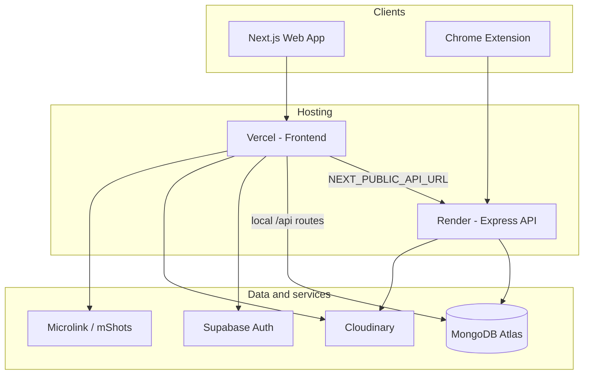

memory404 uses a split-stack architecture in production: a Next.js frontend on Vercel and an Express API on Render, both persisting application data to MongoDB Atlas through the native driver. Supabase is used only for authentication.

## System diagram

## Components

### Frontend (Next.js)

The web app at `/` renders `VaultInbox` — the main link vault interface. Additional routes:

| Route | Purpose |
|-------|---------|
| `/` | Main link inbox |
| `/settings` | Profile, stats, data export |
| `/trash` | Soft-deleted items |
| `/workspace` | LED screen editor |

Data fetching uses **SWR** and **SWR Infinite** for cursor-based pagination.

### Backend API (Express)

In production, the Express server on Render handles `/api/groups` and `/api/links` writes. The frontend routes API calls through `NEXT_PUBLIC_API_URL`.

In local development, Next.js Route Handlers at `app/api/` can serve the same endpoints without running Express.

<Warning>
Next.js and Express are not identical. Trash, stats, image-proxy, and soft-delete behavior are only available on Next.js routes. See [API overview](/api-reference/overview).
</Warning>

### Database (MongoDB Atlas)

The MongoDB native Node.js driver provides pooled connections using `MONGODB_URI`; `MONGODB_DB` selects the database and defaults to `memory404`. Data is normalized across `users`, `groups`, and `links` collections. Documents reference owners and groups by ID, while indexes enforce per-user uniqueness and support group, trash, tag, and cursor-pagination queries.

### Chrome extension

Manifest V3 extension that communicates with the API to save tabs. Supports popup UI, omnibox, context menus, and keyboard shortcuts.

### Image pipeline

When a link is saved:

1. **Phase 1** — Fetch HTML, parse Open Graph and meta tags via Cheerio
2. **Provider rules** — Apply branded icons and title parsing for Figma, Notion, GitHub, and others
3. **Upload** — Store preview images on Cloudinary
4. **Phase 2** — If no preview image exists, capture a screenshot via Microlink or mShots

## API routing

The client resolves API base URL in `lib/api-base.ts`:

- `NEXT_PUBLIC_API_URL` set → requests go to Render
- `NEXT_PUBLIC_API_URL` empty → same-origin `/api/*` (Next.js routes)

## Authentication

Supabase Auth middleware refreshes sessions and supplies user identity. The corresponding user profile is upserted into MongoDB, but Supabase does not store groups or links. Auth still **does not gate every route** because the app retains a development-user fallback.

## Free tier keep-alive

Render free services sleep after ~15 minutes of inactivity. The keep-alive workflow pings Render, Vercel, and the Supabase Auth health endpoint; MongoDB connectivity is checked by application health routes. See [Keep-alive](/deployment/keep-alive).
