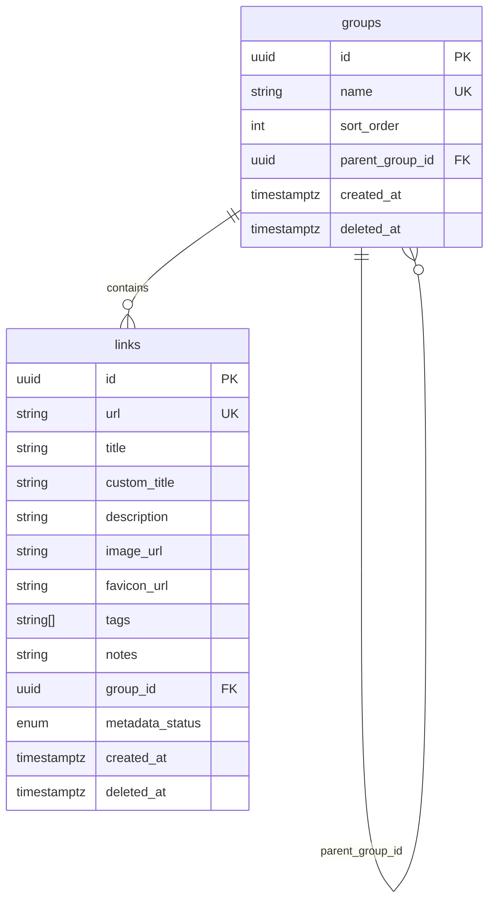

memory404 uses two PostgreSQL tables managed by Prisma: `links` and `groups`.

## Entity relationship



## links table

| Column | Type | Notes |
|--------|------|-------|
| `id` | UUID PK | `gen_random_uuid()` |
| `url` | String UNIQUE | Required, globally unique |
| `title` | String | System/metadata title |
| `custom_title` | String? | User override |
| `description` | String? | Scraped description |
| `image_url` | String? | Preview/screenshot URL |
| `favicon_url` | String? | Site favicon |
| `tags` | String[] | Lowercase on write |
| `notes` | String? | User notes |
| `group_id` | UUID FK | References `groups.id`, `onDelete: Restrict` |
| `metadata_status` | Enum | `pending` or `ready` |
| `created_at` | Timestamptz | Auto-set on create |
| `deleted_at` | Timestamptz? | `null` = active, set = in Trash |

### Indexes

- `group_id`
- `(created_at DESC, id DESC)` — cursor pagination
- `deleted_at` — trash queries

## groups table

| Column | Type | Notes |
|--------|------|-------|
| `id` | UUID PK | `gen_random_uuid()` |
| `name` | String UNIQUE | Required |
| `sort_order` | Int | Default 0, General = 0 |
| `parent_group_id` | UUID? FK | Self-reference for nesting |
| `created_at` | Timestamptz | Auto-set on create |
| `deleted_at` | Timestamptz? | Soft-delete |

### Indexes

- `parent_group_id`
- `sort_order`

## Enums

### LinkMetadataStatus

| Value | Description |
|-------|-------------|
| `pending` | Enrichment in progress |
| `ready` | Metadata complete |

## Seed behavior

- **General** group is auto-created on first `GET /api/groups`
- Legacy **Uncategorized** group was migrated to **General**

## Display title logic

```
display_title = customTitle ?? providerResolvedTitle ?? title ?? url
```

## Soft-delete

Both tables use `deleted_at` for soft-delete:

- Active items: `deleted_at IS NULL`
- Trash items: `deleted_at IS NOT NULL`
- 30-day retention before purge

## Prisma schema

The source of truth is `prisma/schema.prisma`:

```prisma
model Link {
  id             String             @id @default(dbgenerated("gen_random_uuid()"))
  url            String             @unique
  title          String
  customTitle    String?
  groupId        String
  metadataStatus LinkMetadataStatus @default(pending)
  deletedAt      DateTime?
  // ...
}

model Group {
  id            String    @id @default(dbgenerated("gen_random_uuid()"))
  name          String    @unique
  sortOrder     Int       @default(0)
  parentGroupId String?
  deletedAt     DateTime?
  // ...
}
```
