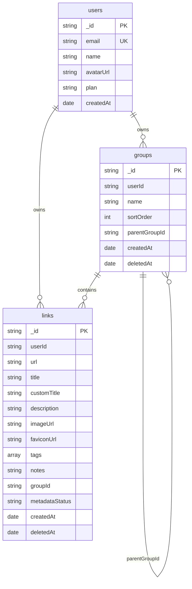

memory404 uses the MongoDB native Node.js driver. Application data is normalized into three collections: `users`, `groups`, and `links`. Relationships are stored as string IDs so documents stay small and ownership can be enforced on every query.

## Entity relationship



## users collection

| Field | Type | Notes |
|-------|------|-------|
| `_id` | String | Supabase Auth user ID |
| `email` | String | Required and globally unique |
| `name` | String or null | Display name |
| `avatarUrl` | String or null | Profile image |
| `plan` | String | Defaults to `free` |
| `createdAt` | Date | Set when the user is first persisted |

### Indexes

- `{ email: 1 }`, unique

## groups collection

| Field | Type | Notes |
|-------|------|-------|
| `_id` | String | Application-generated UUID |
| `userId` | String | References `users._id` |
| `name` | String | Unique within a user |
| `sortOrder` | Number | General starts at 0 |
| `parentGroupId` | String or null | References another `groups._id` |
| `createdAt` | Date | Set on create |
| `deletedAt` | Date or null | `null` when active |

### Indexes

- `{ userId: 1, name: 1 }`, unique
- `{ userId: 1, sortOrder: 1 }`
- `{ parentGroupId: 1 }`
- `{ userId: 1, deletedAt: 1 }`

## links collection

| Field | Type | Notes |
|-------|------|-------|
| `_id` | String | Application-generated UUID |
| `userId` | String | References `users._id` |
| `url` | String | Unique within a user |
| `title` | String | System or metadata title |
| `customTitle` | String or null | User override |
| `description` | String or null | Scraped description |
| `imageUrl` | String or null | Preview or screenshot URL |
| `faviconUrl` | String or null | Site favicon |
| `tags` | String[] | Lowercase on write |
| `notes` | String or null | User notes |
| `groupId` | String | References `groups._id` |
| `metadataStatus` | String | `pending` or `ready` |
| `createdAt` | Date | Set on create |
| `deletedAt` | Date or null | `null` when active |

### Indexes

- `{ userId: 1, url: 1 }`, unique
- `{ groupId: 1 }`
- `{ createdAt: -1, _id: -1 }`
- `{ deletedAt: 1 }`
- `{ userId: 1, deletedAt: 1, createdAt: -1, _id: -1 }`
- `{ userId: 1, groupId: 1, deletedAt: 1, createdAt: -1, _id: -1 }`
- `{ tags: 1 }`

## Metadata status

| Value | Description |
|-------|-------------|
| `pending` | Enrichment in progress |
| `ready` | Metadata complete |

## Seed behavior

- **General** group is auto-created on first `GET /api/groups`
- Legacy **Uncategorized** group was migrated to **General**

## Display title logic

```
display_title = customTitle ?? providerResolvedTitle ?? title ?? url
```

## Soft-delete

The `groups` and `links` collections use `deletedAt` for soft-delete:

- Active items: `deletedAt: null`
- Trash items: `deletedAt` contains a date
- 30-day retention before purge

## Index initialization

`ensureMongoIndexes()` in `lib/db/mongodb.ts` creates the indexes idempotently. It runs during Express startup and the Postgres-to-MongoDB migration. Both the Next.js and Express paths use the same collections and repository layer.
