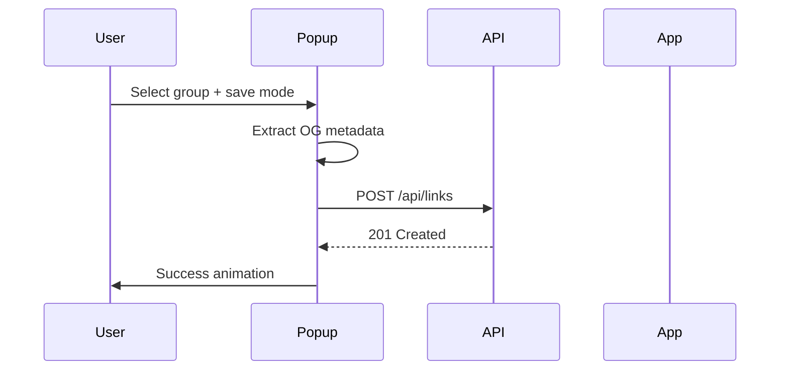

The extension popup is the primary way to save links from Chrome.

## Open the popup

- Click the memory404 icon in the toolbar
- Press `Alt+Shift+L` (Windows/Linux) or `Option+Shift+L` (macOS)
- Right-click a page and select **Add to LK → Just Save**

## Save modes

| Mode | Description |
|------|-------------|
| **This Tab** | Save the currently active tab |
| **Selected (N tabs)** | Save all highlighted tabs in the tab bar |
| **Chrome Tab Group** | Save all tabs in the current Chrome tab group |

## Group picker

The popup shows your groups fetched from the API. You can:

- Select an existing group
- Search groups by name
- Create a new group inline

The extension remembers your last saved group (`lastSavedGroupId`) and pre-selects it on next open.

## Metadata extraction

When saving, the extension extracts Open Graph metadata from the page:

- `og:title` → link title
- `og:description` → description
- `og:image` → preview image

This metadata is sent with the `POST /api/links` request to speed up enrichment.

## Settings panel

Open settings from the popup to configure:

| Setting | Description |
|---------|-------------|
| **App URL** | Base URL of the memory404 web app and API |

Default: `http://localhost:3000`

## Caching

Groups are cached in `chrome.storage.local` for faster popup loads. The cache refreshes on each popup open.

## Save flow

## Error handling

| Error | Cause |
|-------|-------|
| Groups failed to load | App URL misconfigured or API unreachable |
| 409 Conflict | URL already saved |
| 503 Service Unavailable | Database not configured |

The popup shows progressive loading messages during save operations.
