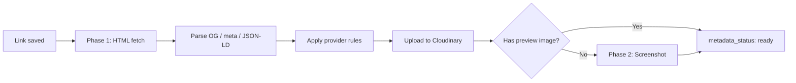

When you save a link, memory404 enriches it with title, description, favicon, and preview images in the background.

## Enrichment pipeline



### Phase 1 — HTML metadata

1. Fetch the page HTML
2. Parse Open Graph, Twitter Card, meta tags, and JSON-LD
3. Extract favicon URL
4. Apply provider-specific title and icon rules
5. Upload images to Cloudinary
6. Set `metadata_status: ready`

### Phase 2 — Screenshot fallback

If no preview image was found (and the site is not login-gated):

1. Capture a screenshot via Microlink API
2. Fall back to WordPress mShots if Microlink fails
3. Upload the screenshot to Cloudinary

Override the screenshot provider with `SCREENSHOT_URL_TEMPLATE` in your environment.

## Metadata status

| Status | Meaning |
|--------|---------|
| `pending` | Enrichment in progress |
| `ready` | Metadata complete |

The UI polls pending links every 4 seconds for up to 10 minutes after creation.

## Link providers

memory404 recognizes major platforms and applies branded icons and smarter title parsing:

| Provider | Features |
|----------|----------|
| Figma | Branded icon, URL-based title parsing |
| Google Docs / Drive | Workspace title extraction |
| SharePoint / OneDrive | Microsoft branding |
| GitHub | Repository and file title parsing |
| Notion | Page title from URL |
| Linear | Issue title extraction |
| Canva, Miro, Loom | Branded icons |
| Slack, Zoom, Dropbox | Branded icons with fallbacks |

Provider rules live in `lib/link-providers/registry.ts`. The first matching provider wins.

## Login-gated sites

Sites that require authentication (Figma, Notion, Slack, etc.) show a placeholder image (`/placeholder-unicorn.jpg`) instead of attempting screenshots.

## Display title logic

The title shown on cards follows this priority:

1. `customTitle` — user override (set via PATCH)
2. Provider-resolved title — from URL parsing rules
3. `title` — scraped metadata title
4. URL — fallback

## Refresh preview

Force re-enrichment of a link's metadata:

```bash
curl -X PATCH http://localhost:3000/api/links/{id} \
  -H "Content-Type: application/json" \
  -d '{ "refreshPreview": true }'
```

This resets `metadata_status` to `pending` and re-runs the full enrichment pipeline.

## Image proxy

For CORS-blocked preview images, the Next.js image proxy serves them with cache headers:

```
GET /api/image-proxy?url={encodedUrl}
```

Trusted CDNs (Cloudinary, Google favicons) bypass the proxy.
